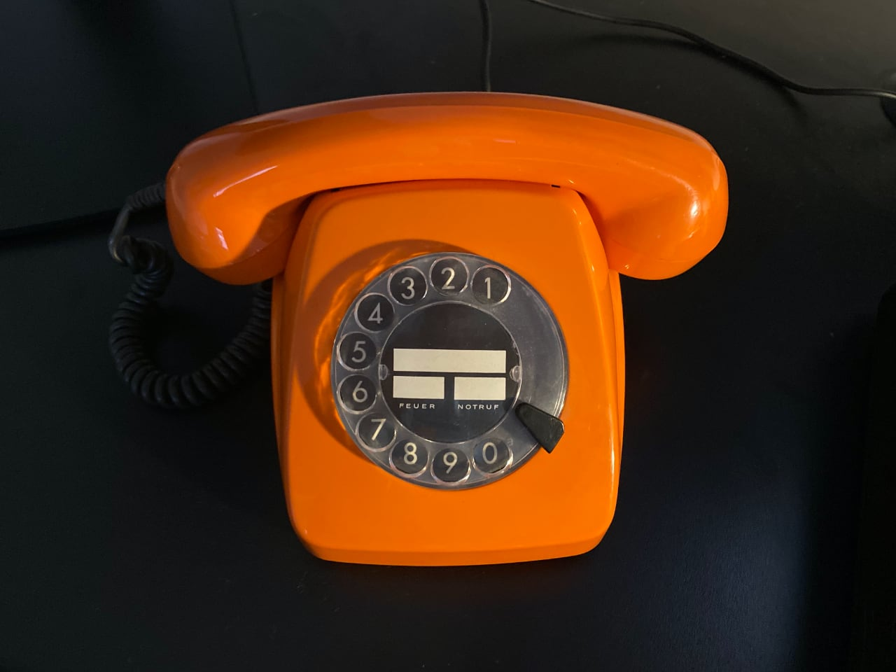
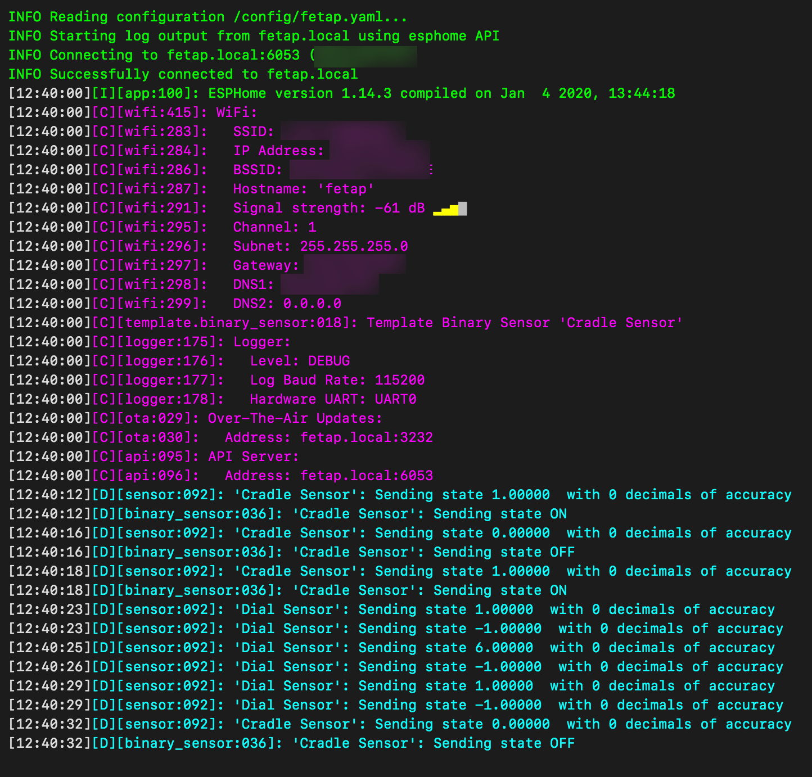

# ESPHome-FeTAp

Interprets impulses from an old FeTAp telephone and makes them available as ESPHome sensor data.

Use cases include controlling your home lightning by dialing numbers on the dial pad.

## Exposed Sensors

* **Cradle Sensor:** Sends `ON` when the cradle is lifted up, and `OFF` when it’s hung up.
* **Dial Sensor:** Sends `0-9`, depending on what the digit you’ve dialed. Note that after publishing the digit, it immediately changes back to its default state -1, so dialing the the same digit multiple times in a row will always cause the sensor to change.

## Log Output

## Hardware

* Unmodified FeTAp 611
* ESP32 DEVKIT V1

## Sources

* [machina eX](https://www.youtube.com/channel/UClhZwejfKVzuA_tIZgygVYA) on YouTube: [Game On Stage Level 3. Tutorial#1 - Arduino küsst Telefon - YouTube](https://www.youtube.com/watch?v=KcvgQ9eWKDU)
* mikrocontroller.net: [Hauptcode_mit_Testcode_2.ino](https://www.mikrocontroller.net/attachment/highlight/431817)

